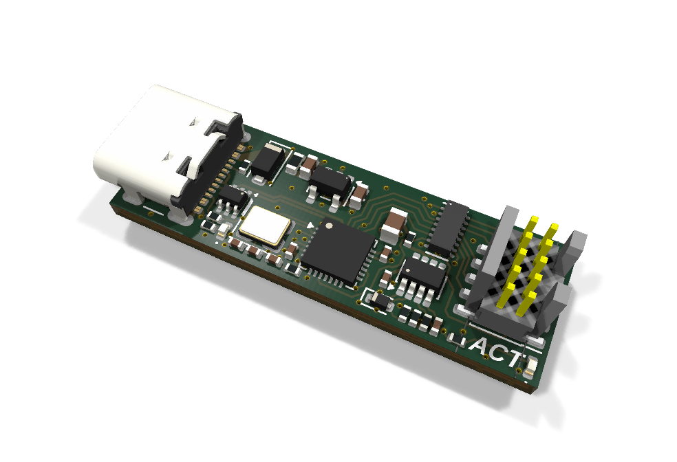
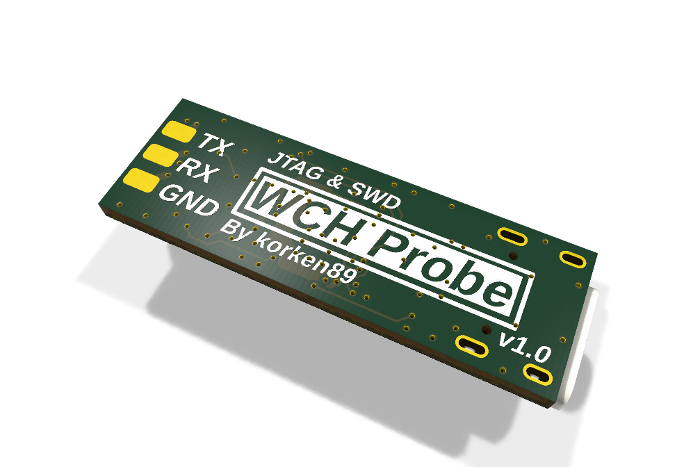

# wch-probe

KiCad hardware for a CH347F-based JTAG & SWD debug probe: USB-C on one end, a
10-pin 1.27 mm Cortex debug header on the other, plus a UART on the bottom-side
TX/RX/GND pads. The I/O voltage (VIO) tracks the target's VTref (valid range
1.8 V to 3.3 V), and defaults to 3.3 V when the target does not drive VTref.

<p align="center">
  
  
</p>

## Fabrication

The fabrication outputs (gerber zip, BOM, placement file, schematic PDF) for
each board revision are attached to the
[releases](https://github.com/korken89/wch-probe/releases). To generate them
locally, `make fab` writes the same set to `Fabrication/` and `make check`
runs ERC and DRC; both need KiCad 10's `kicad-cli`.

## Ordering

JLCPCB, 4 layers, 1.6 mm thick. Order options:

- Stackup: JLC04161H-7628 with impedance control (the USB pair is 90 ohm
  differential)
- Surface finish: HASL lead-free
- Remove order number: yes

## USB identity

Stock CH347s ship with a blank config and all enumerate with the same default serial.
Use [wch-cfg](https://github.com/korken89/wch-cfg) to write each board's USB identity
(serial number, product and manufacturer strings):

```sh
wch-cfg version --min 1.01 && wch-cfg write --init --random-serial --product wch-probe --manufacturer korken89
# replug the board (the chip reads the strings at power-on), then
wch-cfg verify --serial <the printed serial> --product wch-probe --manufacturer korken89
```

`write` prints the serial for the label on stdout once the OS has enumerated it.

## License

CERN-OHL-P-2.0, see [LICENSE](LICENSE).
